# rxjs-inspector 🕵️‍♂️

> A minimal “flight recorder” for RxJS streams.  
> Records subscribe / next / error / complete / unsubscribe as a structured event stream (NDJSON-ready) for replay and visualization.

> **Created with the support of ChatGPT 5.1 Extended Thinking.**

---

## What is RxJS Inspector?

**RxJS Inspector** is a small instrumentation layer for RxJS that quietly watches your streams at runtime and records what actually happens:

- When an `Observable` is **subscribed** to  
- Every **next** value  
- **Errors**  
- **Complete** events  
- When a `Subscription` is **unsubscribed**

All of this is turned into a stream of structured events that you can:

- Log as **NDJSON** (newline-delimited JSON)  
- Stream to a **visualization tool** (e.g. DevTools UI, dashboard)  
- Use to generate **timelines / diagrams** (Mermaid, etc.)  
- **Replay** later when debugging tricky behavior

This README describes the **Minimal Viable Version (MVP)**, a.k.a. **Milestone 1 – core runtime recorder**.

---

## MVP Features (Milestone 1)

✅ **Automatic instrumentation**

- Monkey-patches `Observable.prototype.subscribe`
- Monkey-patches `Subscription.prototype.unsubscribe`
- Assigns stable IDs:
  - `observableId`
  - `subscriptionId`

✅ **Events emitted for**

- `observable-create`
- `subscribe`
- `next`
- `error`
- `complete`
- `unsubscribe`

✅ **Central Notification Bus**

- All events emitted into a single `Subject<NotificationEvent>`
- Exposed as `notifications$` (an `Observable<NotificationEvent>`)

✅ **NDJSON-ready output**

- Each `NotificationEvent` can be serialized as one JSON line
- Suitable for:
  - File logging
  - Streaming over WebSocket
  - Offline replay and analysis

✅ **Visualization-friendly**

- Events can be grouped and transformed into:
  - Text logs
  - Mermaid **timelines** / diagrams
- Example: a debounced search pipeline rendered as a time-based diagram

---

## High-Level Architecture

1. **Setup (Instrumentation)**  
   Call `installRxjsInstrumentation()` once at app startup to monkey-patch RxJS.

2. **Collection**  
   The instrumentation layer emits `NotificationEvent`s into a `notificationSubject`.

3. **Persistence / Transport**  
   You subscribe to `notifications$`:
   - Write events as NDJSON to a file  
   - Or stream them to a visualization tool (e.g. via WebSocket)

4. **Visualization**  
   A separate step (or app) reads the events and generates:
   - Timelines  
   - Flow diagrams  
   - DevTools-style UI

---

## Core Types (simplified)

```ts
export type NotificationType =
  | 'observable-create'
  | 'subscribe'
  | 'next'
  | 'error'
  | 'complete'
  | 'unsubscribe';

export interface NotificationEvent {
  type: NotificationType;
  timestamp: number;

  observableId: number;
  subscriptionId?: number;

  value?: unknown;
  error?: unknown;
  info?: string; // optional description (e.g. operator name, query, etc.)
}
```

---

## Getting Started

> This MVP is structured as a small TypeScript + RxJS library plus examples.

### Install dependencies

```bash
npm install
```

### Build

```bash
npm run build
```

### Run the simple example

```bash
npm run simple
```

This will:

- Instrument RxJS
- Run a small pipeline
- Log `NotificationEvent`s as **NDJSON** to `rxjs-inspector.ndjson`

---

## Example 1 – Simple pipeline

### Code under inspection

```ts
import { from, map, filter } from 'rxjs';

export const result$ = from([1, 2, 3, 4, 5, 6, 7, 8, 9]).pipe(
  map(n => n * 10),
  filter(n => n > 40),
);

result$.subscribe();
```

### NDJSON-style events (conceptual)

What RxJS Inspector might write to `rxjs-inspector.ndjson`:

```text
{"type":"observable-create","timestamp":0,"observableId":1,"info":"from([1..9]).pipe(map*10, filter>40)"}
{"type":"subscribe","timestamp":1,"observableId":1,"subscriptionId":1}
{"type":"next","timestamp":2,"observableId":1,"subscriptionId":1,"value":50}
{"type":"next","timestamp":3,"observableId":1,"subscriptionId":1,"value":60}
{"type":"next","timestamp":4,"observableId":1,"subscriptionId":1,"value":70}
{"type":"next","timestamp":5,"observableId":1,"subscriptionId":1,"value":80}
{"type":"next","timestamp":6,"observableId":1,"subscriptionId":1,"value":90}
{"type":"complete","timestamp":7,"observableId":1,"subscriptionId":1}
{"type":"unsubscribe","timestamp":7,"observableId":1,"subscriptionId":1}
```

### Mermaid timeline (generated from events)

```mermaid
timeline
  title from([1,2,3,4,5,6,7,8,9]) |> map n×10 |> filter n>40

  section result$
    observable-create obs1            : 0.000
    subscribe sub1 obs1               : 0.001
    next 50 (sub1 obs1)               : 0.002
    next 60 (sub1 obs1)               : 0.003
    next 70 (sub1 obs1)               : 0.004
    next 80 (sub1 obs1)               : 0.005
    next 90 (sub1 obs1)               : 0.006
    complete sub1 obs1                : 0.007
    unsubscribe sub1 obs1             : 0.007
```



---

## Example 2 – Debounced search (conceptual)

```ts
import { debounceTime, distinctUntilChanged, switchMap } from 'rxjs';
import { Observable } from 'rxjs';

interface SearchResult {
  total: number;
  items: string[];
}

declare const searchInput$: Observable<string>;
declare function searchApi(query: string): Observable<SearchResult>;

export const searchResult$ = searchInput$.pipe(
  debounceTime(300),
  distinctUntilChanged(),
  switchMap(query => searchApi(query)),
);

// Somewhere in UI:
searchResult$.subscribe();
```

With RxJS Inspector enabled, you can capture a **timeline** that shows:

- Raw keystrokes
- Debounced queries
- Cancelled HTTP requests
- Final results

---

## Roadmap / Future Milestones

Planned ideas beyond the MVP:

- 🌐 WebSocket-based **live DevTools panel** (browser UI)
- 🎨 Richer **operator-level views** (grouping events per stage, not just per observable)
- ⏱️ “Slow-motion replay” mode (respecting original timing)
- 🧪 Integration with test runners to capture traces per test
- 📦 Publish as an npm package (`rxjs-inspector`)

---

## Credits

- **Author:** (you)  
- **Co-designer / Support:** ChatGPT 5.1 Extended Thinking  
  (Concept, architecture, documentation, and examples co-created in conversation.)
